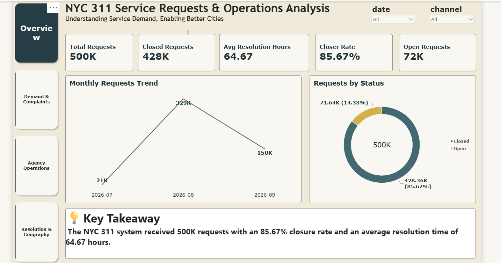
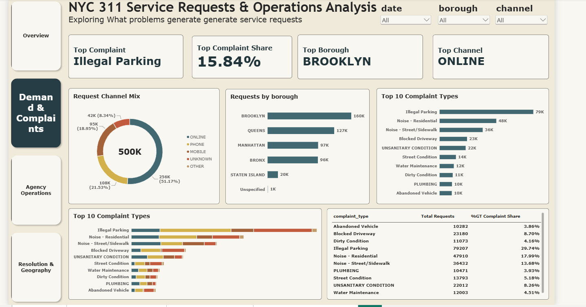
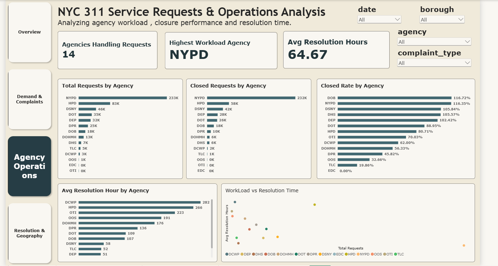
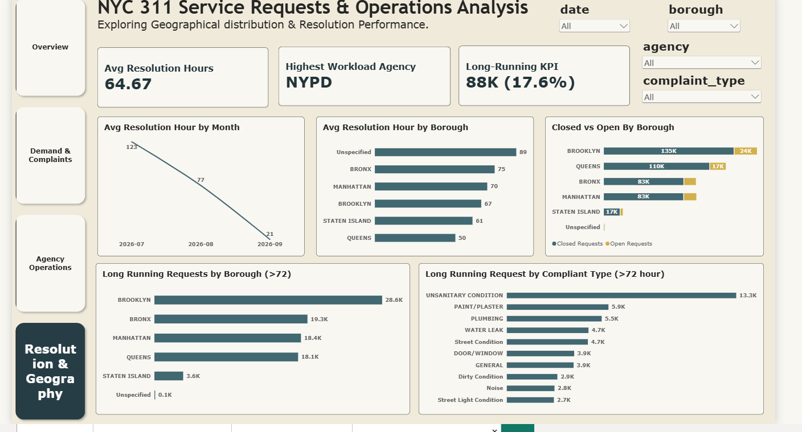

# NYC 311 Service Requests & Operations Analysis

Analyzing NYC 311 service demand, agency workload, closure performance, and request resolution time using **SQL and Power BI**.

---

## 📌 Table of Contents

* [Overview](#overview)
* [Business Problem](#business-problem)
* [Dataset & Data Preparation](#dataset--data-preparation)
* [Data Modeling](#data-modeling)
* [Power BI Dashboard](#power-bi-dashboard)
* [Key Insights](#key-insights)
* [Business Recommendations](#business-recommendations)
* [Tools & Technologies](#tools--technologies)
* [Project Structure](#project-structure)
* [How to Run](#how-to-run)
* [Data Limitations](#data-limitations)
* [Author & Contact](#author--contact)

---

## Overview

This project analyzes approximately **500K NYC 311 service requests** to understand:

* Service-request demand
* Complaint patterns
* Borough-level workload
* Agency workload
* Request closure performance
* Resolution time
* Long-running requests

The raw data was transformed using **MySQL and SQL**, structured using a **star-schema data model**, and analyzed through an interactive **Power BI dashboard**.

---

## Business Problem

NYC 311 receives service requests across multiple complaint types, boroughs, channels, and agencies.

This project focuses on answering key operational questions:

* Which complaint types generate the highest demand?
* Which boroughs generate the most requests?
* Which agencies handle the highest workload?
* What percentage of requests are closed?
* How long do requests take to resolve?
* Which requests remain unresolved for more than 72 hours?
* Where do differences in workload and resolution performance appear?

---

## Dataset & Data Preparation

### Dataset

The project uses the **NYC 311 Service Requests** dataset from NYC Open Data.

The analyzed data contains information such as:

* Request creation and closure dates
* Complaint types
* Agencies
* Boroughs and locations
* Request channels
* Request status
* Community and district information

Approximately **500K service-request records** were analyzed.

### Data Preparation

The raw dataset was loaded into **MySQL** and transformed using SQL.

Key preparation steps included:

* Reviewing data structure and quality
* Standardizing relevant fields
* Converting date/time fields
* Calculating resolution time in hours
* Identifying open and closed requests
* Creating a long-running request indicator for requests exceeding 72 hours
* Creating dimension tables
* Creating the central fact table
* Validating transformed data before Power BI analysis

---

## Data Modeling

A **star-schema dimensional data model** was created to support analytical reporting.

### Fact Table

**Fact_ServiceRequests**

Contains service-request level records and analytical fields including:

* Agency
* Agency Name
* Borough
* Channel
* Complaint Type
* Created Date
* Closed Date
* Status
* Location attributes
* Resolution Time (Hours)

### Dimension Tables

| Dimension      | Purpose                                   |
| -------------- | ----------------------------------------- |
| `dim_date`     | Date, month, year and year-month analysis |
| `dim_agency`   | Agency-level workload analysis            |
| `dim_borough`  | Borough-level analysis                    |
| `dim_channel`  | Request-channel analysis                  |
| `dim_location` | Geographic and location attributes        |
| `dim_problem`  | Complaint/problem classification          |
| `dim_status`   | Open and closed request analysis          |

### Star Schema


---

## Power BI Dashboard

An interactive Power BI dashboard was developed to analyze NYC 311 operations from multiple perspectives.

### Page 1 — Overview

Provides a high-level view of service demand and operational performance.



**Key metrics:**

* Total Requests
* Closed Requests
* Open Requests
* Closure Rate
* Average Resolution Hours
* Monthly Request Trend
* Request Status Distribution

---

### Page 2 — Demand & Complaints

Analyzes the major drivers of service-request demand.



**Key analysis:**

* Top Complaint Type
* Complaint Share
* Requests by Borough
* Request Channel Mix
* Top Complaint Types
* Complaint-level request distribution

---

### Page 3 — Agency Operations

Evaluates agency workload and operational performance.



**Key analysis:**

* Agencies Handling Requests
* Highest Workload Agency
* Total Requests by Agency
* Closed Requests by Agency
* Closure Rate by Agency
* Average Resolution Hours by Agency
* Workload vs. Resolution Time

---

### Page 4 — Resolution & Geography

Analyzes resolution performance and geographical patterns.



**Key analysis:**

* Average Resolution Hours
* Long-Running Requests (>72 hours)
* Average Resolution Hours by Month
* Average Resolution Hours by Borough
* Closed vs. Open Requests by Borough
* Long-Running Requests by Borough
* Long-Running Requests by Complaint Type

### Interactive Filters

The dashboard allows users to filter the analysis by:

* Date
* Borough
* Agency
* Complaint Type
* Channel

---

## Key Insights

### 1. High Service-Request Volume

Approximately **500K service requests** were analyzed across multiple agencies, complaint types, boroughs, and channels.

### 2. Majority of Requests Are Closed

Approximately **428K requests were closed**, while around **72K remained open**, resulting in an overall closure rate of approximately **85.67%**.

### 3. Illegal Parking Is the Largest Complaint Category

**Illegal Parking** was the largest complaint category, with approximately **79K requests** and a share of about **15.84%**.

### 4. Brooklyn Has the Highest Request Volume

**Brooklyn** recorded the highest service-request volume among the analyzed boroughs, with approximately **160K requests**.

### 5. Online Is the Largest Request Channel

Online submissions represented approximately **51.17%** of the analyzed requests.

### 6. NYPD Handles the Largest Workload

**NYPD** had the highest request volume among the agencies shown in the dashboard, with approximately **233K requests**.

### 7. Resolution Time Varies Across Operations

The overall average resolution time was approximately **64.67 hours**, with differences observed across agencies and boroughs.

### 8. Long-Running Requests

Approximately **88K requests**, or **17.6%** of analyzed requests, took more than **72 hours** to resolve.

Brooklyn recorded the highest number of long-running requests at approximately **28.6K**.

### 9. Long-Running Requests Concentrate in Specific Complaint Types

Higher volumes of long-running requests were observed for categories such as:

* Unsanitary Condition
* Paint/Plaster
* Plumbing
* Water Leak
* Street Condition

These categories can be investigated further to understand potential resolution delays.

---

## Business Recommendations

Based on the patterns identified in the analysis:

### 1. Monitor High-Volume Complaint Categories

Regularly monitor high-volume categories such as **Illegal Parking** and **Noise-related requests** to understand demand patterns and support operational planning.

### 2. Monitor Long-Running Requests

Requests approaching or exceeding the **72-hour threshold** can be placed under dedicated aging or exception monitoring.

### 3. Review Borough-Level Workload

Brooklyn has the highest overall request volume and the highest number of long-running requests in the analyzed data. Borough-level workload and resolution metrics can therefore be monitored together.

### 4. Investigate Agency-Level Differences

Differences in agency workload and resolution time can be investigated further based on:

* Request volume
* Complaint characteristics
* Case complexity
* Operational processes
* Resource availability

The analysis identifies these patterns but does not establish their underlying causes.

---

## Tools & Technologies

| Tool / Technology | Purpose                                                  |
| ----------------- | -------------------------------------------------------- |
| **MySQL**         | Data preparation, transformation and validation          |
| **SQL**           | Queries, joins, aggregations and analytical calculations |
| **Power Query**   | Data transformation and preparation                      |
| **Power BI**      | Dashboard development and visualization                  |
| **DAX**           | KPI and analytical measures                              |
| **Star Schema**   | Dimensional data modeling                                |
| **Git & GitHub**  | Version control and project documentation                |

---

## Project Structure

```text
NYC 311 Project/
│
├── README.md
│
├── SQL/
│   └── nyc_311.sql
│
├── data model/
│   └── Data_Model_Star_Schema.png
│
├── Dashboard/
│   └── NYC 311 Requests Analysis.pbix
│
├── images/
│   ├── Overview.png
│   ├── Demand_complaints.png
│   ├── Agency_operations.png
│   └── Resolution_geography.png
│
└── NYC 311 Requests Report/
    └── NYC_311_Service_Requests_Analysis.pdf

---

## How to Run

### 1. MySQL

* Install MySQL and MySQL Workbench.
* Create a database for the project.
* Import the NYC 311 dataset.
* Run the SQL script from the `sql/` folder.
* Review the resulting fact and dimension tables.

### 2. Data Model

Review the star-schema model in:

```text
data model/star_schema.png
```

### 3. Power BI

* Open the `.pbix` file from the `power bi/` folder.
* Connect to the MySQL database if required.
* Refresh the data.
* Explore the four dashboard pages.

---

## Data Limitations

* The analysis is based on an approximately **500K-row sample** of NYC 311 service-request data.
* Results represent the records included in the analytical dataset and should not automatically be treated as a complete representation of all NYC 311 activity.
* Some records contain missing or unspecified values.
* Resolution-time analysis depends on the availability and quality of request creation and closure timestamps.
* The analysis identifies operational patterns but does not establish the underlying causes.

---

## Author & Contact

**Monika Gupta**

Data Analyst

📧 **Email:** [monikagupta9412@gmail.com](mailto:monikagupta9412@gmail.com)

🔗 **LinkedIn:** [linkedin.com/in/monika-gupta-677691311](https://www.linkedin.com/in/monika-gupta-677691311/)
